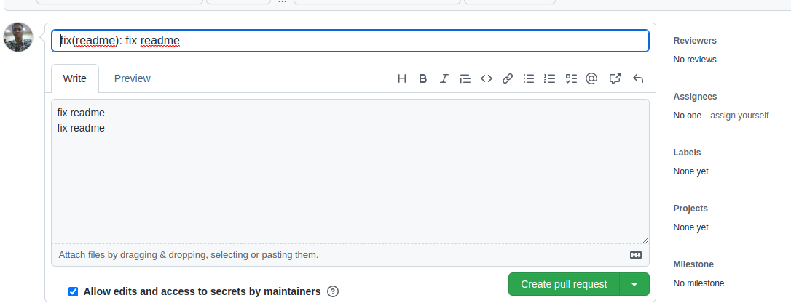

# 💎 4C (The Cool Community of Content Creators)

Imagine **The Cool Community For Content Creators** or **4C**, as a chill coffee shop (cooler even 💣). An inclusive and helpful environment, where we help content creators reach their goals by sharing experiences.

Gain access to exclusive talks/workshops with popular content creators, and hence, opportunities to collaborate.

We have games too! 🎮

## 👋 Join Us :
Join our amazing community on Discord and Twitter.

<a href="https://discord.com/invite/cRjhjFRRre"></a><a href="https://twitter.com/4ccommunityhq"></a>

<br>


## 📷 Website overview

This repository concerns the 4C community [website](https://www.4c.rocks/). Visit the website to stay up to date with community members' projects, active members, and other amazing content!

## 🎉 Want to contribute?

Whether you are a community member or not, we would love your point of view! Feel free to first check out our [code of conduct](https://github.com/FrancescoXX/4c-site/blob/main/CODE_OF_CONDUCT.md) and also the [contribution guidelines](https://github.com/FrancescoXX/4c-site/blob/main/CONTRIBUTING.md) for any missing steps.

### 💻 For Contributors

#### 🔖 Tech Stack

The code base of this repo uses

- [NextJS](https://nextjs.org/)
- [TailwindCSS](https://tailwindcss.com/)

For contributing to the code, you will need

- [Node](https://nodejs.org/en/) installed on your computer.
- Basic knowledge of [Git](https://git-scm.com/)

#### 🔖 Contribution steps

You can directly work on this project on Gitpod!

[](https://gitpod.io/#https://github.com/FrancescoXX/4c-site)

Or, to work on it locally,

1. [Fork](https://github.com/FrancescoXX/4c-site) this repository
2. Clone the repo

   ```console
   $ git clone git@github.com:<your github username>/4c-site.git
   ```
3. Navigate to the cloned directory

   ```console
   $ cd 4c-site
   ```
4. Install dependencies

   ```console
   $ npm install
   ```
5. Start the project on `localhost`

   ```console
   $ npm run dev
   ```

##### Troubleshooting

In the course of trying to set up the project locally, if you come across an error that says `PWA is not supported`, you can try the following steps below to fix it;

> For Linux or Mac 👇

1. Go to 4c-site folder using `cd 4c-site`
2. In the terminal,

   ```console
   $ export NODE_OPTIONS=--openssl-legacy-provider
   ```
3. If you get an error in the above code then use the option below

   ```console
   $ unset NODE_OPTIONS=""
   ```
4. Start the development server with

   ```console
   $ npm run dev
   ```

> For Windows 👇

1. Go to 4c-site folder using `cd 4c-site`
2. In the terminal,
   ```console
   $ set NODE_OPTIONS=--openssl-legacy-provider
   ```
3. Start the development server with
   ```console
   $ npm run dev
   ```

In order to run this project locally, you might require some additional configurations, such as downgrading your `node` version to v16.
You may get an error similar to this:


To fix this, downgrade your `node` version to v16. Here is a simple way of doing that with the [`nvm` node version manager](https://github.com/nvm-sh/nvm):

1. Download and install `nvm`. Use [nvm-setup.exe](https://github.com/coreybutler/nvm-windows/releases) for windows, or [install.sh](https://raw.githubusercontent.com/nvm-sh/nvm/v0.39.3/install.sh) on other systems.
2. Install version v16

   ```console
   $ nvm install 16.16.0
   ```
3. Make your system use version 16 of node

   ```console
   $ nvm use 16.16.0
   ```

To check if everything has worked, restart your shell and run `node -v`. The output should be `v16.16.0`. If it is, you can continue working on the project!


#### Run commit 

 After checking the lint and immediately after staging your changes with "git add", type the command:
 
   ```console
   $ npm run commit
   ```
   
After running the command you will be asked to input a couple of details regarding your commit.
This is what the details you fill in on the terminal will appear as:

Pay attention to:

- type
- scope
- subject
- body
- footer

This is what mine looks like after I set my:

- "type" to fix
- "scope" to readme
- "subject" to fix readme
- "body" to fix readme
- "footer" to fix readme



N.B: In my case I was just writing "fix readme"
You can then push your changes.

Done!

#### 🔖 Adding a project to the project page

> Note: _The project page is reserved to display projects for community members only. Each member can put up only one project._

To add your project to the project page, head over to the [`/data`](https://github.com/FrancescoXX/4c-site/tree/main/src/data) directory, and subsequently, the `projects.json` file. There, you will find objects for each project.

For example,

```json
{
  "name": "Francesco Ciulla",
  "title": "FREE Web3 Resources",
  "screenshot": "https://user-images.githubusercontent.com/18360871/199210192-f5599a23-f0b1-49ff-9c52-2554a72a2c14.png",
  "description": "A list of resources to learn Web3 for FREE",
  "link": "https://github.com/FrancescoXX/free-Web3-resources",
  "twitter": "https://twitter.com/FrancescoCiull4",
  "live_link": "https://www.freeweb3resources.com",
  "stack":  ["React", "CSS", "Solidity"]
}
```

- Create a new object similar to the one above.
- Follow the example above and create project details like;
  - Your name
  - The project's title
  - A screenshot
  - A short description
  - A link to the GitHub repo (If it is open source)
  - A link to your Twitter profile
  - A live link to the project.
- Open a pull request 👍

---

Notice anything odd and/or missing from this README or on the website itself? Feel free to raise an [issue](https://github.com/FrancescoXX/4c-site/issues).

Join the amazing [4C community](https://discord.com/invite/cRjhjFRRre) on discord, and follow us on [Twitter](https://twitter.com/4ccommunityhq) to stay in the loop.

# 🔑 License

This repository is under the [MIT](./LICENSE) license.

Please leave a star ⭐️ All support is highly appreciated.
